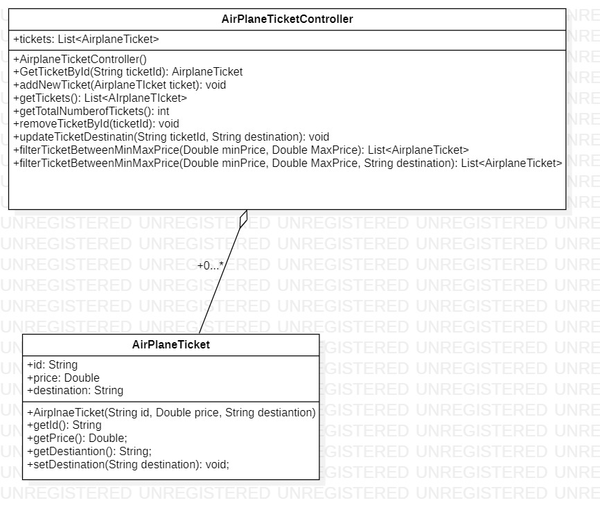
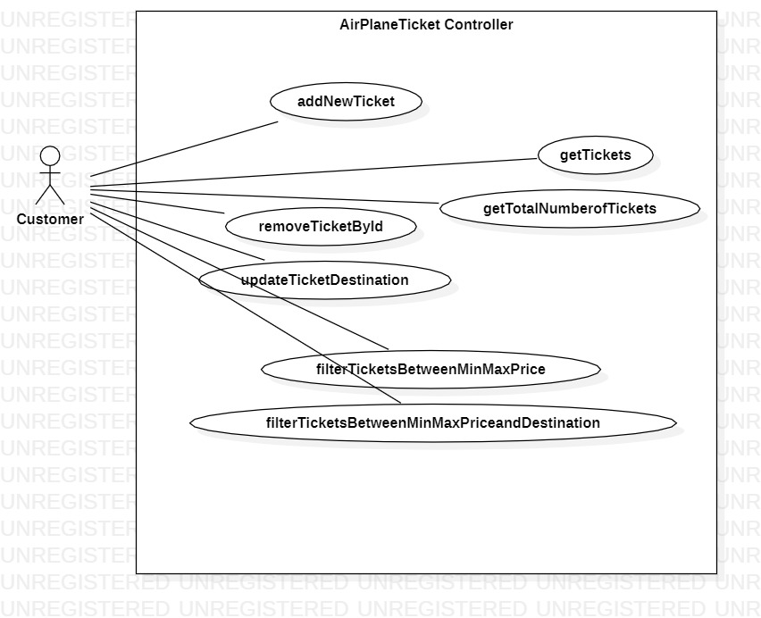

# Group lab

Steps for resolving lab:
- Create a team of 4 or 5 students. Teams should be composed of studens from the same group (no mixed groups please);
- Create a git repository and add team members to it;
- Repository should be public;
- Choose one of the samples c2, c3, c4, c5 as the starting point for your project and copy cX-sample content to your repository;
- Fill spreadsheet with team members and repository: https://docs.google.com/spreadsheets/d/1W3gAzS_ujQS-24xwYNMeMhQVzMRZiooaxVFbo4rH6Hw
- For selected project:
    * fix the implementation so that all tests pass;
    * design a minimal user interface (UI) for the program and implement it using Swing - UI should be implemented for one of the last two packages or a combination of last to packages functions (c2 -> packages 3,4,5 c3 -> packages 3,4 c4 -> packages 3,4 c5 -> packages 3,4);
    * try to apply MVC design pattern in implementing the UI;
    * create UML Use-Case diagram for selected package for which UI has been implemented;
    * create UML Class diagram; for selected package for which UI has been implemented;
- Try to work as a team and each member of the team to resolve part of the problem.

## Exercise 2 - Use case diagram

## Exercise 3 - Sequence diagram

